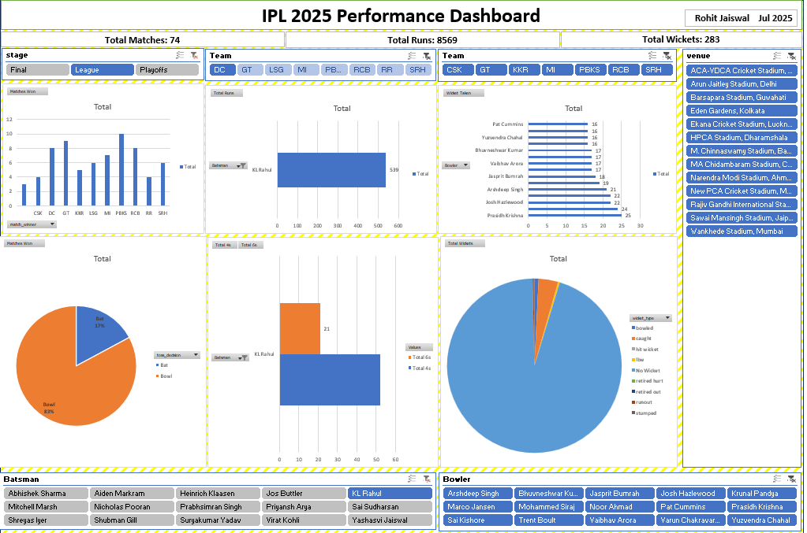

# 🏏 IPL 2025 Performance Analysis & Dashboard (Excel)

📊 A performance analysis and interactive dashboard project using Microsoft Excel and the IPL 2025 dataset from Kaggle. The project covers team and player-level insights using data cleaning, transformation, pivot tables, and visual storytelling.

---

## 📁 Files Included
- `IPL_2025_Performance_Dashboard.xlsx`: Final Excel dashboard with slicers, pivot tables, charts, and filters.
- `data/`: Raw CSV files (deliveries, matches, orange_cap, purple_cap).
- `screenshots/`: Visual previews of the dashboard and chart insights.

---

## 📈 Key Features
- Cleaned and structured IPL 2025 match and player data using Power Query
- Performance metrics calculated (strike rate, economy rate, wickets, boundaries)
- Pivot Tables for:
  - Team-wise wins & toss impact
  - Top batsmen & bowlers
  - Wicket type distribution
  - Match result trends by stage and venue
- Fully interactive dashboard using slicers for team, venue, stage, and player
- Simple, clean layout with bar, column, and pie charts

---

## 📊 Dashboard Preview

Take a look at the final interactive Excel dashboard built using IPL 2025 data. The dashboard allows users to:

- Instantly filter insights using slicers (Team, Player, Venue, Stage)
- Visualize top-performing batsmen and bowlers
- Analyze match outcomes and trends with bar, column, and pie charts
- Gain quick, meaningful insights through a clean and user-friendly layout

> 🎯 Designed for clarity, interactivity, and storytelling — built 100% in Excel.

---

## 🛠️ Tools & Technologies
- **Microsoft Excel**
  - Power Query for data cleaning
  - Pivot Tables for summarizing performance
  - Slicers for interactivity
  - Charts for visual insights

---

## 🔗 Dataset Source
[Kaggle – IPL 2025 Records by krishd123](https://www.kaggle.com/datasets/krishd123/ipl-2025-records)

---

## 👤 Author
**Rohit Jaiswal**  
MCA | Aspiring Data Analyst  
📬 Open to roles in Data Analytics and Visualization  
